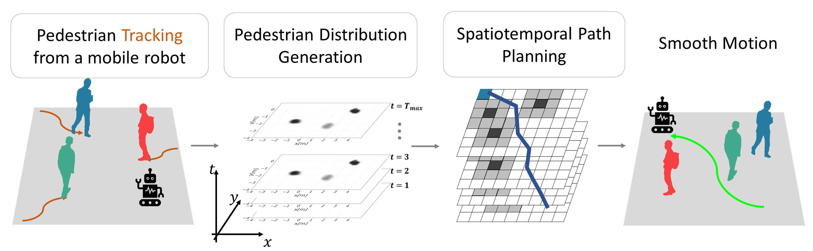

# Spatiotemporal Navigation based on Pedestrian Trajectory Prediction in Dense Crowds

## Yuta Sato, Yoko Sasaki, Hiroshi Takemura

## Spatiotemporal Navigation



We proposes a means of autonomous mobile robot navigation in dense crowds that is based on predicting the future trajectories of pedestrians.
The method includes a pedestrian trajectory prediction for a running mobile robot and spatiotemporal path planning for when the crosses path with pedestrians.
The predicted trajectories are converted into a time-series of cost maps, and the robot achieves smooth navigation without dodging to the right or left in crowds, path planner does not require long-term prediction.
The results of an evaluation implementing this method in a real robot in a Science Museum show that the trajectory prediction works. Moreover, the proposed planning's arrival times decrease to 73.6% of conventional 2D path planning's arrival time in a simulation of navigation in a crowd of 50 people.

## **Using the code:**

```bash
python3 two_maze.py -i [Path of input image/origin] -o [Path of output directory for simulation images] --st_r [y of a start] --st_c [x of a start] --go_r [y of a goal] --go_c [x of a goal]
python3 two_maze.py -i origin_pred_map/000/origin/ -o output_dir --st_r 270 --st_c 160 --go_r 130 --go_c 240
```

```bash
python3 spatiotemporal.py -i [Path of input image] -o [Path of output directory for simulation images] --st_r [y of a start] --st_c [x of a start] --go_r [y of a goal] --go_c [x of a goal]
python3 spatiotemporal.py -i origin_pred_map/000/ -o output_dir --st_r 270 --st_c 160 --go_r 130 --go_c 240
```

![sim trajectories](images/sim_setting_and_trajectories.png
